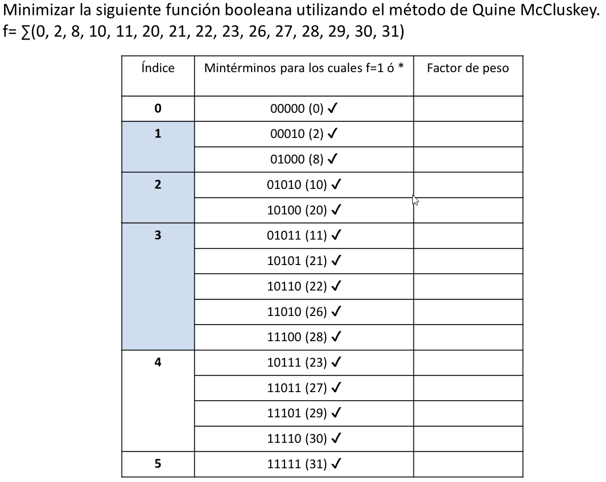
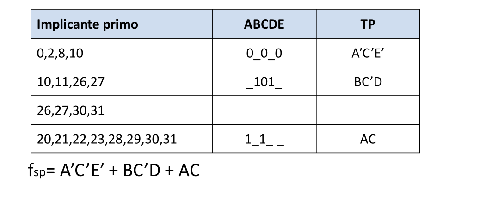
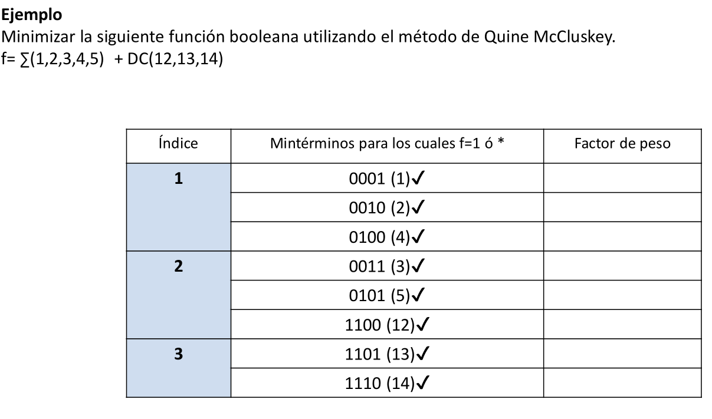
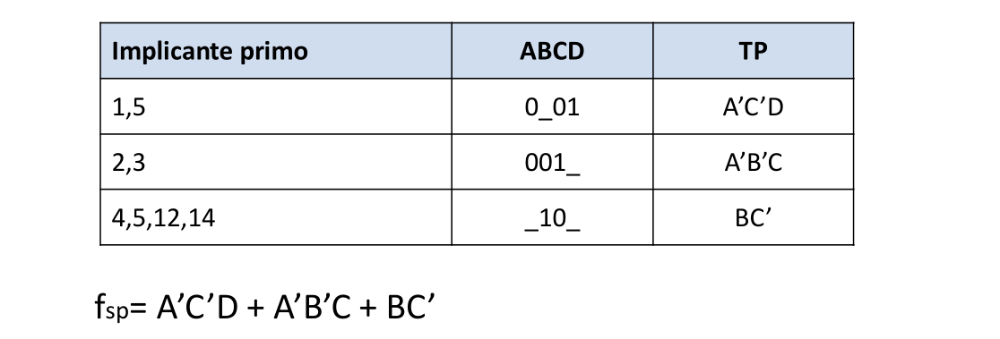
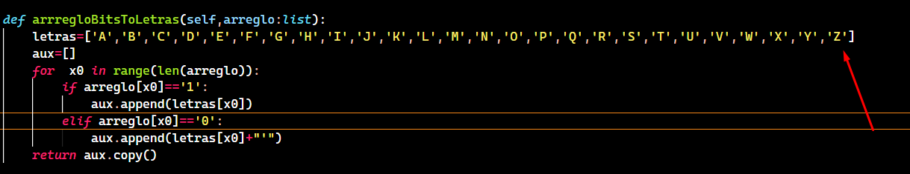

```json
{
    'nombre': 'Barrera Peña  Víctor Miguel',
    'tipo': 'Proyecto',
    'no': '2',
    'grupo':  '6',
    'materia': '1645 Diseño Digital Moderno',
    'semestre': '2022-1',
    'enunciado': 'Programar el algoritmo de Quine McCluskey' ,
    'fecha': '15-10-2021'
}
```


# Algoritmo_Quine-McCluskey

# Introducción

Este es un algoritmo eficaz para simplificar  mini términos para muchas variables, y su funcionamiento deriva de lo que sucede a dos miniterminos que tienen una variable de diferencia, estos se pueden simplificar , pero para la máquina podríamos interpretarlo como 11 + 10 donde el primero es A y el segundo es B, también hay don´t care representado como `-`
$$
ABc + AB´c \Longrightarrow A(B+B')  \Longrightarrow A(1)  \Longrightarrow A
$$


# Desarrollo 

El desarrollo de proyecto fue hecho en python por razones de rapidez, ya que el programa fué hecho por una sola persona y además suele tener pocos problemas de .exe con respecto a otros cuando se compila, exceptuado a aquellos que tienen versión de windows 10 inestable y/o 11.

La explicación del código estará en youtube, al igual que la prueba del código, sin embargo la explicación será hecha cuando haga las mejoras que explico en mi conclusión, no son necesarias para al nivel que se pidió el proyecto, sin embargo pienso que se debe hacer, ya que después de terminar la entrega es necesario pulir el código, aunque también pensaría en la idea de pasarlo a **Go,Rust** , ya que estos son mucho más veloces para procesar mucha información.

Para posteriores versiones de este código, puede irse a github, donde estará la versión más actual del código.

## Demostración de funcionamiento

Vamos a probar con los ejemplos dados por ele profesor para este algoritmo y comprobemos que las respuestas son correctas, tu también puedes comprobar que es correcto guardando la entrada que muestro en un archivo `input.txt`

### Ejemplo 1



````python
# input.txt
    5,0, 2, 8, 10, 11, 20, 21, 22, 23, 26, 27, 28, 29, 30, 31,-1
````


significa que  encontró el archivo 

la salida del archivo `output.txt`

```

 Tabla de minimizaciones 
 
-------------------------------------------------------------------------------------
│generacion 	|indice     	| bits       	| miniterminos                   	|
-------------------------------------------------------------------------------------
│0          	│ 0          	│ 00000      	│ 0                              	│
│0          	│ 1          	│ 00010      	│ 2                              	│
│0          	│ 1          	│ 01000      	│ 8                              	│
│0          	│ 2          	│ 01010      	│ 10                             	│
│0          	│ 3          	│ 01011      	│ 11                             	│
│0          	│ 2          	│ 10100      	│ 20                             	│
│0          	│ 3          	│ 10101      	│ 21                             	│
│0          	│ 3          	│ 10110      	│ 22                             	│
│0          	│ 4          	│ 10111      	│ 23                             	│
│0          	│ 3          	│ 11010      	│ 26                             	│
│0          	│ 4          	│ 11011      	│ 27                             	│
│0          	│ 3          	│ 11100      	│ 28                             	│
│0          	│ 4          	│ 11101      	│ 29                             	│
│0          	│ 4          	│ 11110      	│ 30                             	│
│0          	│ 5          	│ 11111      	│ 31                             	│
-------------------------------------------------------------------------------------
│1          	│ 0          	│ 000-0      	│ 0,2                            	│
│1          	│ 0          	│ 0-000      	│ 0,8                            	│
│1          	│ 1          	│ 0-010      	│ 2,10                           	│
│1          	│ 1          	│ 010-0      	│ 8,10                           	│
│1          	│ 2          	│ 0101-      	│ 10,11                          	│
│1          	│ 2          	│ -1010      	│ 10,26                          	│
│1          	│ 2          	│ 1010-      	│ 20,21                          	│
│1          	│ 2          	│ 101-0      	│ 20,22                          	│
│1          	│ 2          	│ 1-100      	│ 20,28                          	│
│1          	│ 3          	│ -1011      	│ 11,27                          	│
│1          	│ 3          	│ 101-1      	│ 21,23                          	│
│1          	│ 3          	│ 1-101      	│ 21,29                          	│
│1          	│ 3          	│ 1011-      	│ 22,23                          	│
│1          	│ 3          	│ 1-110      	│ 22,30                          	│
│1          	│ 3          	│ 1101-      	│ 26,27                          	│
│1          	│ 3          	│ 11-10      	│ 26,30                          	│
│1          	│ 3          	│ 1110-      	│ 28,29                          	│
│1          	│ 3          	│ 111-0      	│ 28,30                          	│
│1          	│ 4          	│ 1-111      	│ 23,31                          	│
│1          	│ 4          	│ 11-11      	│ 27,31                          	│
│1          	│ 4          	│ 111-1      	│ 29,31                          	│
│1          	│ 4          	│ 1111-      	│ 30,31                          	│
-------------------------------------------------------------------------------------
│2          	│ 0          	│ 0-0-0      	│ 0,2,8,10                       	│
│2          	│ 2          	│ -101-      	│ 10,11,26,27                    	│
│2          	│ 2          	│ 101--      	│ 20,21,22,23                    	│
│2          	│ 2          	│ 1-10-      	│ 20,21,28,29                    	│
│2          	│ 2          	│ 101--      	│ 20,21,22,23                    	│
│2          	│ 2          	│ 1-1-0      	│ 20,22,28,30                    	│
│2          	│ 2          	│ 1-10-      	│ 20,21,28,29                    	│
│2          	│ 2          	│ 1-1-0      	│ 20,22,28,30                    	│
│2          	│ 3          	│ 1-1-1      	│ 21,23,29,31                    	│
│2          	│ 3          	│ 1-11-      	│ 22,23,30,31                    	│
│2          	│ 3          	│ 11-1-      	│ 26,27,30,31                    	│
│2          	│ 3          	│ 111--      	│ 28,29,30,31                    	│
-------------------------------------------------------------------------------------
│3          	│ 2          	│ 1-1--      	│ 20,21,22,23,28,29,30,31        	│
└-----------------------------------------------------------------------------------┘

Tabla de implicaciones 
┌───────────────────────────────────────────────────────────────────────────────────────────┐
│ Implicante primo              │0  │2  │8  │10 │11 │20 │21 │22 │23 │26 │27 │28 │29 │30 │31 │
├───────────────────────────────────────────────────────────────────────────────────────────┤
│ 20,21,22,23,28,29,30,31       │0  │0  │0  │0  │0  │1  │1  │1  │1  │0  │0  │1  │1  │1  │1  │
│ 26,27,30,31                   │0  │0  │0  │0  │0  │0  │0  │0  │0  │1  │1  │0  │0  │1  │1  │
│ 10,11,26,27                   │0  │0  │0  │1  │1  │0  │0  │0  │0  │1  │1  │0  │0  │0  │0  │
│ 0,2,8,10                      │1  │1  │1  │1  │0  │0  │0  │0  │0  │0  │0  │0  │0  │0  │0  │
└───────────────────────────────────────────────────────────────────────────────────────────┘

 Miniterminos Resultado
┌───────────────────────────────────────────────────────────────────────────────────┐
|generacion 	│ indice     	│ bits       	│ miniterminos                   	│
├───────────────────────────────────────────────────────────────────────────────────┤
│2          	│ 0          	│ 0-0-0      	│ 0,2,8,10                       	│
│2          	│ 2          	│ -101-      	│ 10,11,26,27                    	│
│3          	│ 2          	│ 1-1--      	│ 20,21,22,23,28,29,30,31        	│
└───────────────────────────────────────────────────────────────────────────────────┘


 fsp=A'C'E' + BC'D + AC
```

comparemos con lo obtenido del profesor



Es correcto

### Ejemplo 2

```python
# input.txt
4,1,2,3,4,5,12,13,14,12
```




Para este `output.txt` obtiene lo siguiente

```

 Tabla de minimizaciones 
 
-------------------------------------------------------------------------------------
│generacion 	|indice     	| bits       	| miniterminos                   	|
-------------------------------------------------------------------------------------
│0          	│ 1          	│ 0001       	│ 1                              	│
│0          	│ 1          	│ 0010       	│ 2                              	│
│0          	│ 2          	│ 0011       	│ 3                              	│
│0          	│ 1          	│ 0100       	│ 4                              	│
│0          	│ 2          	│ 0101       	│ 5                              	│
│0          	│ 2          	│ 1100       	│ 12                             	│
│0          	│ 3          	│ 1101       	│ 13                             	│
│0          	│ 3          	│ 1110       	│ 14                             	│
-------------------------------------------------------------------------------------
│1          	│ 1          	│ 00-1       	│ 1,3                            	│
│1          	│ 1          	│ 0-01       	│ 1,5                            	│
│1          	│ 1          	│ 001-       	│ 2,3                            	│
│1          	│ 1          	│ 010-       	│ 4,5                            	│
│1          	│ 1          	│ -100       	│ 4,12                           	│
│1          	│ 2          	│ -101       	│ 5,13                           	│
│1          	│ 2          	│ 110-       	│ 12,13                          	│
│1          	│ 2          	│ 11-0       	│ 12,14                          	│
-------------------------------------------------------------------------------------
│2          	│ 1          	│ -10-       	│ 4,5,12,13                      	│
└-----------------------------------------------------------------------------------┘

Tabla de implicaciones 
┌───────────────────────────────────────────────────────────────┐
│ Implicante primo              │1  │2  │3  │4  │5  │12 │13 │14 │
├───────────────────────────────────────────────────────────────┤
│ 4,5,12,13                     │0  │0  │0  │1  │1  │1  │1  │0  │
│ 12,14                         │0  │0  │0  │0  │0  │1  │0  │1  │
│ 2,3                           │0  │1  │1  │0  │0  │0  │0  │0  │
│ 1,5                           │1  │0  │0  │0  │1  │0  │0  │0  │
│ 1,3                           │1  │0  │1  │0  │0  │0  │0  │0  │
└───────────────────────────────────────────────────────────────┘

 Miniterminos Resultado
┌───────────────────────────────────────────────────────────────────────────────────┐
|generacion 	│ indice     	│ bits       	│ miniterminos                   	│
├───────────────────────────────────────────────────────────────────────────────────┤
│1          	│ 1          	│ 001-       	│ 2,3                            	│
│2          	│ 1          	│ -10-       	│ 4,5,12,13                      	│
│1          	│ 1          	│ 0-01       	│ 1,5                            	│
└───────────────────────────────────────────────────────────────────────────────────┘


 fsp=A'B'C + BC' + A'C'D
```


Comprobamos el resultado



El mismo resultado esperado


# Links

- Explicación del algoritmo:
  - No disponible por el momento (disponibilidad 01/12/2021)
- Video Mostrando el funcionamiento
  - Youtube: https://www.youtube.com/watch?v=aSNwUpH2t7U

Github:

https://github.com/EzioFenix/Algoritmo_Quine-McCluskey

ramas: 

- alternativa-> Con más mejoras v 0.12
- dev -> funciones en desarrollo v.013
- main -> v0.11 Más estable

# Explicación de como usar el programa

Tienes 2 opciones,  ejecutar el `exe` o el `main.py`

Yo te recomiendo usar el `.py` , ya que lo puedes ejecutar y tiene menos probabilidad de error, y además instalar python es ultra rápido.

1. Guardas un archivo llamado `input.txt`  en la misma carpeta del `.exe`donde tenga los siguiente:
   1. `a,b1,b2,b3,...,bn,c`
   2. por ejemplo `5,1,2,3,4,5,6,31,6`
   3. Tiene que ser guardado en un archivo donde después del 6, no tenga intro.
   4. El término `a` es el número de variables que va a represntar, por ejemplo los mini términos sólo tienen `XY` pues introduzco el número `2`.
   5. Los términos `b1` hasta `bn` son todos los mini términos que introducirá. Sólo hay un pequeño detalle , todos los **don´t care** tienen que ir a la derecha, por ejemplo `1,3,2,4`. En el anterior ejemplo 1,3 son mini términos y 2,4 son don´t care.
   6. Para especificarle al programa cuales son don´t care, usamos el termino `c`. Para el ejemplo anterior pondría el término `2`, ya que a partir del `2`y hacia la derecha son todos términos don´t care. Si no contiene términos **don´t  care** entonces colocas `-1` y con ello no habrá don´t care.
   7. Después de ello el programa te generará un archivo `output.txt`
2. Ahora, si el programa no detecta que hay un archivo con el nombre `input.txt`, te pedirá ingresarlo manualmente.
   1. Pide el número de variables
   2. Pide que si quieres términos  don´t care, introduces `s` para si, `n` para no
   3. introduces el término a partir del cual ese y los siguientes mini términos serán don´t care, por ejemplo introduzco  3, y después `4,5,6`, por tanto `3,4,5,6,....` serán don´t care.
   4. Ahora te pedirá introducir mini términos, introduce todos los mini términos, recuerda que los don´t care tienen que ir al final.
   5. para terminar de introducir mini términos tienes que introducir la letra `t`.
3. Se generará un archivo `output.txt`

Si no se entendió, puedes ver el video en la sección de **Links** en donde dice mostrando funcionamiento

# Conclusión

El proyecto se realizó exitosamente, la meta era desarrollar el algoritmo de Quine-McCluskey para simplificar circuitos, se pedían que fueran  para más de 16 variables, y pensando bien en como lo estructure, creo que el algoritmo sólo se romperá hasta lo que la máquina soporte, ya que lo hice de modo iterativo y usando memoria ram, y esta bien optimizado.

Si tu quisieras poner 1000 variables, se puede , sólo que hay que modificar ciertas cosas:

1. Modificar  para que el tamaño de la tabla sea dinámico y quede bien de acuerdo al número de mini términos.
2.  Agregar más letras  o pares de ellas, por ejemplo podrías agregar  al final A2 y sería valida o "A-2", cualquier fila de n-caracteres sirve como variable mientras no tenga `´` ya que el sistema pensaría que es negada y tú te confundirías.



3.- La solución tomada no siempre es la mejor, la tabla de implicantes, si bien sirve para tomar una solución optima,  puede que exista una mejor combinación por muy poco, para ello se recomienda agregar un algoritmo llamado **Algoritmo codicioso** con el cual es posible comprobar todas las posibles combinaciones y obtener una de las mejores.
